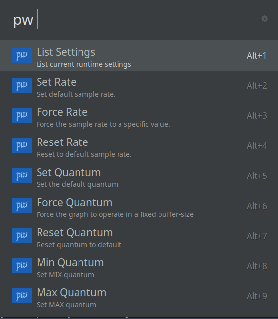
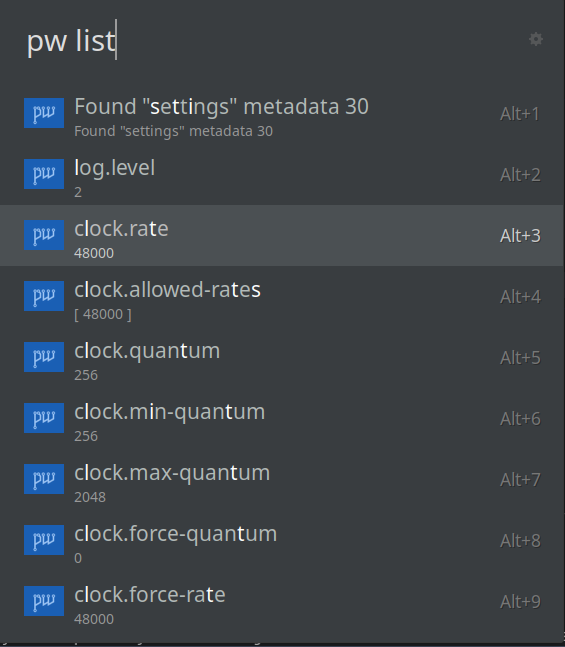
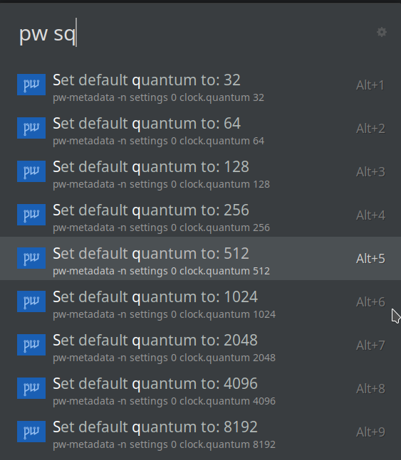
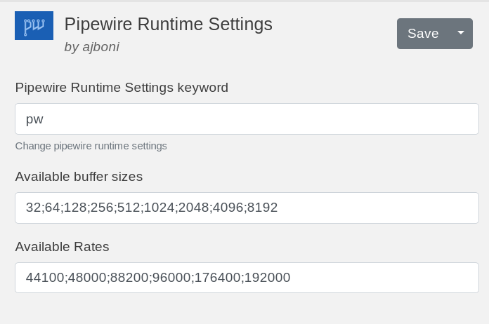

# ulauncher-pipewire-runtime-settings

This is a ulauncher extension for setting [PipeWire runtime settings](https://gitlab.freedesktop.org/pipewire/pipewire/-/wikis/Config-PipeWire#runtime-settings)

## Requirements 

* pipewire
* python

## Installation

Installation instructions can be found at https://ext.ulauncher.io/about. 

## License

Licensed under GNU General Public License v3.0 See LICENSE.

